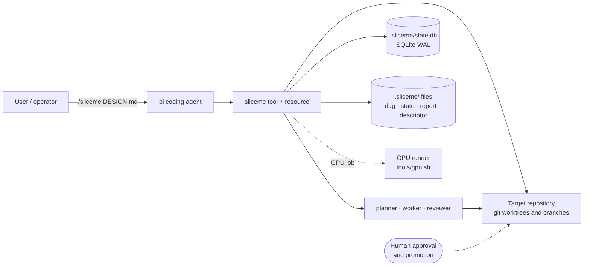
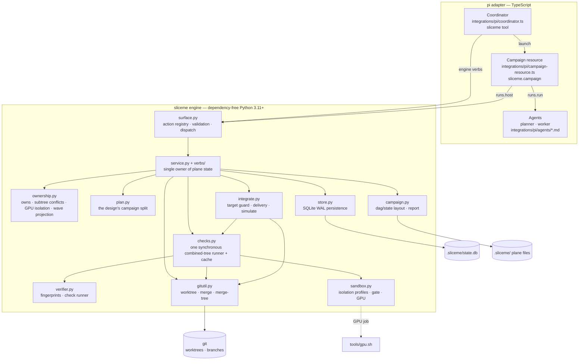
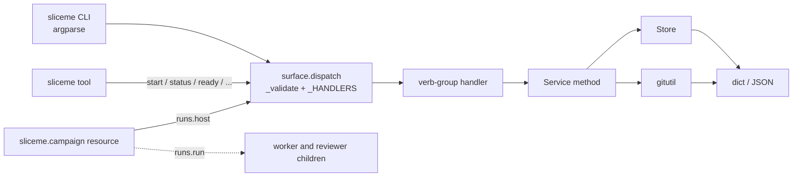
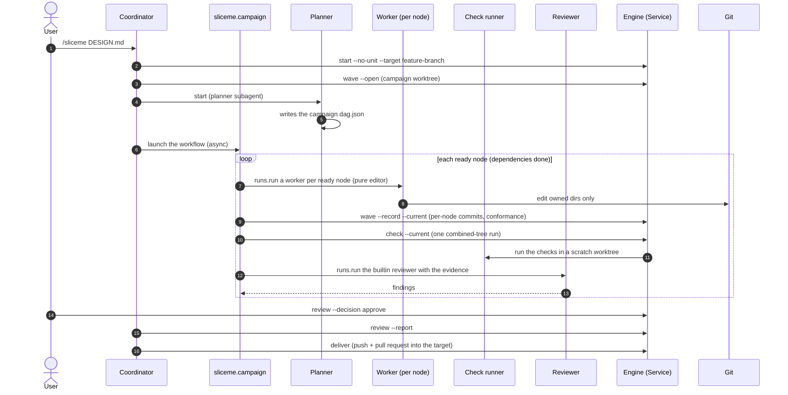
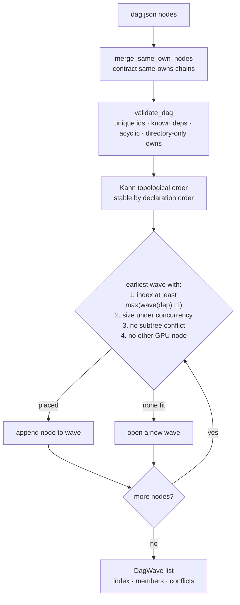
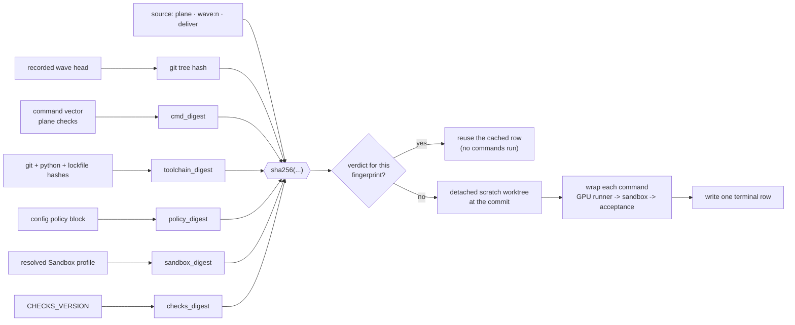
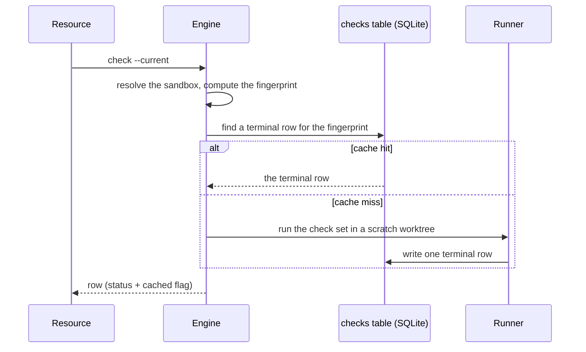
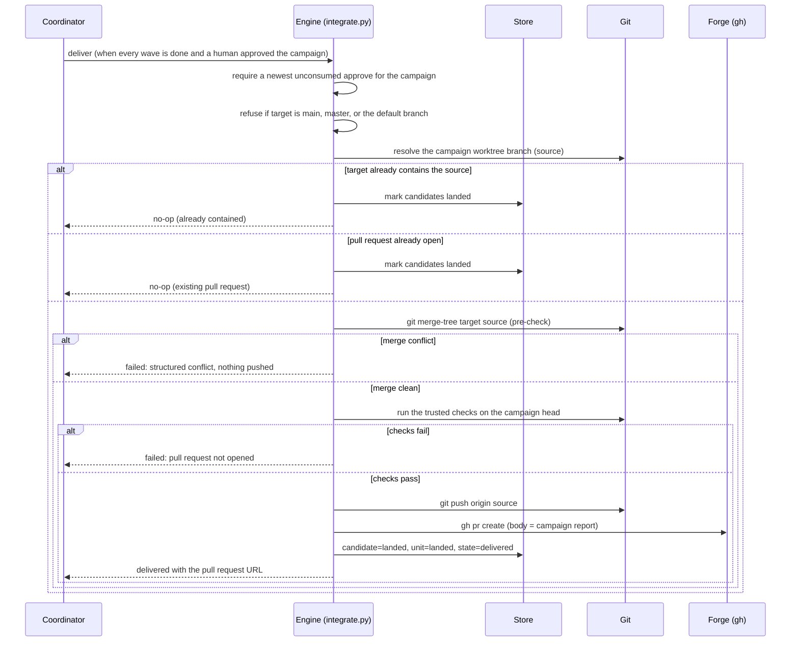
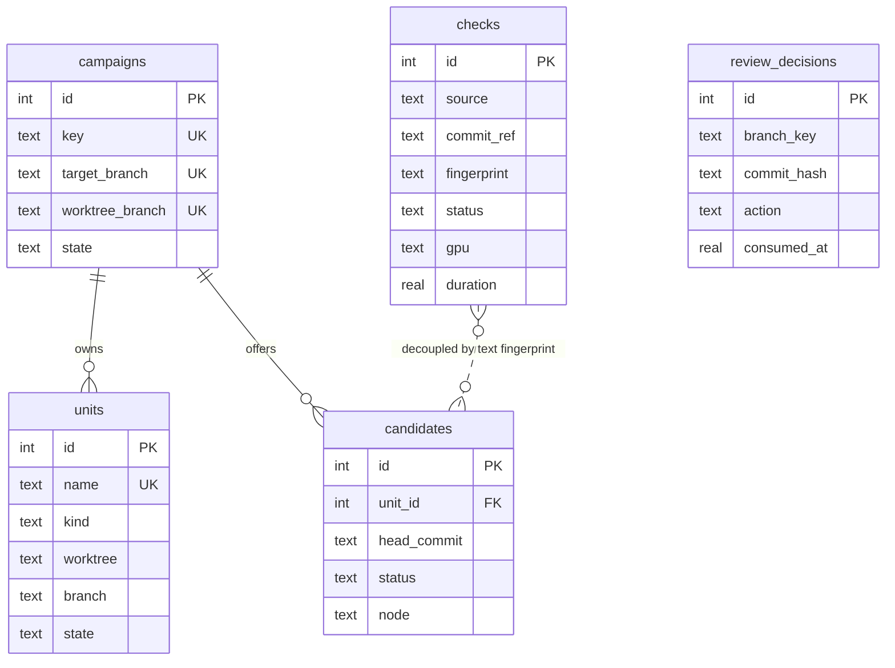
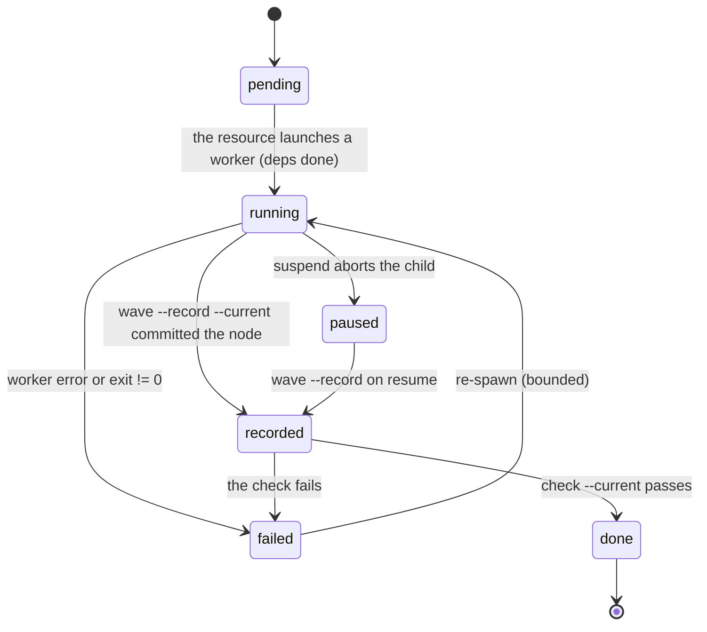

# Sliceme architecture

Status: current.

This document describes the parts of Sliceme: the actors, the engine layers,
the campaign lifecycle, the waves, checks, delivery, and state. It is a map for
contributors and operators. The normative details live in these documents:

- [reference.md](./reference.md) — actions, modules, and state layout.
- [guide.md](./guide.md) — the model, ownership, and orchestration.
- [database.md](./database.md) — the SQLite schema and row lifecycle.
- [workflow.md](./workflow.md) — the campaign loop and the worker contract.

An interactive version of the part diagram with pan and zoom, focus, and
dark/light themes is at [architecture.html](./architecture.html). The source is
[architecture.diagram.json](./architecture.diagram.json).

## 1. In one paragraph

Sliceme turns a design document into a DAG of work. It packs non-conflicting
nodes into waves. It runs one pure-editor worker subagent per node in a single
campaign worktree. One synchronous check runner tests the recorded wave tree
against a content fingerprint. Sliceme then opens one pull request from the
campaign worktree branch onto a target feature branch after approval.

A pi coordinator session owns the campaign loop. The trusted `sliceme.campaign`
workflow resource runs the loop, and pi-subagents owns child execution. A
dependency-free Python engine owns state, isolation, and delivery. The DAG
(`dag.json`) is the only authored schedule, and waves are a pure projection of
it.

## 2. Design principles and invariants

| Principle | Consequence in the code |
|---|---|
| **One engine, many adapters.** | `sliceme/surface.py` is the single action registry. `sliceme/cli.py` is generated from it; the pi tool forwards to the CLI. A packaging test asserts that the tool forwards the engine verbs. |
| **The engine owns state.** | `Service` is the only owner of plane state; adapters parse arguments and render results. The pi extension never writes the database or the DAG. |
| **The DAG is the only schedule.** | `phase` is a display label. Waves are derived from `owns` + `depends_on` + `concurrency` by `ownership.plan_dag_waves`. |
| **Ownership is plan-time and directory-based.** | A node declares the deepest directories it will touch (`owns`). Subtree overlap serializes nodes into different waves. `wave --record` enforces this at run time (plan conformance). |
| **One check runner.** | All checks go through one synchronous runner, so shared resources (and the GPU) stay serialized. The GPU rule adds a single-node wave per GPU node. |
| **Verification is pinned to content.** | A verdict is valid only for an exact `(tree, command vector, toolchain, policy, sandbox, checks, source)` fingerprint. |
| **Git and SQLite win over caches.** | `state.json` is an optional, read-only legacy override that the engine never writes. On conflict, git and `state.db` are authoritative. |
| **Fail closed, fail lastingly.** | A missing sandbox gate or a default-branch target aborts before mutation; a failed check or a forge failure leaves the campaign working. |
| **pi-subagents owns children.** | The resource requests children through `runs.run`; pi-subagents owns status, events, tool scoping, and control. |

## 3. System context

Who and what Sliceme talks to:



- **pi** is the only supported host today. The engine itself is host-agnostic:
  anything that can invoke the CLI gets the same behavior.
- The **target repository** is the product that Sliceme builds. Sliceme mutates
  it only through `git` operations (worktrees, commits, pushes, pull requests).
  Sliceme never commits its own plane files: it adds `.sliceme/` to the
  repository's `.git/info/exclude`.
- **Promotion to the default branch is a human `git` step.** The engine refuses
  to deliver onto `main`, `master`, or the recorded default branch, with no
  override.

## 4. Layered part view



The direction of dependency is always **downward**: surface → service → domain
modules → persistence and git. No domain module imports an adapter, and no
adapter owns state.

### Module responsibilities

| Module | Responsibility |
|---|---|
| `sliceme/surface.py` | **Single source of truth**: the action registry, parameter validation, and dispatch. |
| `sliceme/cli.py` | Generated `argparse` CLI; human and `--json` output. |
| `sliceme/service.py` | The verb facade: composes the verb-group mixins and owns the bound campaign. |
| `sliceme/verbs/` | The verb groups: bootstrap, campaign, status, review, delivery, sessions, support. |
| `sliceme/store.py` | SQLite (WAL) persistence; additive migrations. |
| `sliceme/gitutil.py` | Git plumbing: worktree, merge, merge-tree, branch, head, push. |
| `sliceme/ownership.py` | Directory ownership, the DAG wave projection, GPU isolation, and the same-ownership merge. |
| `sliceme/plan.py` | The design's `sliceme-campaigns` split: parse and validate. |
| `sliceme/verifier.py` | Fingerprints and the sandboxed check runner. |
| `sliceme/sandbox.py` | Isolation profiles, project manifests, the gate, and command wrapping. |
| `sliceme/checks.py` | The single synchronous combined-tree runner and the `checks` cache. |
| `sliceme/integrate.py` | Target-branch guard, pull request delivery, and combined-tree simulation. |
| `sliceme/pullrequest.py` | The `gh` forge client. |
| `sliceme/campaign.py` | `dag.json` / `state.json` layout and readers; deterministic report. |
| `sliceme/review/` | The reduced review surface: `api.py`, `packet.py`, `diff.py`. |
| `integrations/pi/*.ts` | pi adapter: the `sliceme` tool, the `sliceme.campaign` resource, and the invocation helpers. |
| `integrations/pi/agents/*.md` | Planner and worker prompts plus their `tools:` scoping. |

## 5. The action surface and the request path

The engine owns the actions in `surface.ACTIONS`. The `sliceme.campaign`
workflow resource adds the loop; it does not add engine actions.



| Action | Purpose |
|---|---|
| `start` (alias `init`) | Bootstrap the plane and a campaign for the current directory (idempotent). |
| `status` | Units, candidates, waves, checks, health, simulation; `--sessions` and `--resume` cover the campaign registry and the resume plan. |
| `ready` | The current-wave ready node ids, the wave index, and `paused`. |
| `plan` | The design's campaign split joined with the registry state. |
| `deliver` | Push the campaign worktree branch and open the delivery pull request after approval. |
| `check` | The one combined-tree check runner for the current wave. |
| `wave` | The campaign worktree: `--open` or `--record --current`/`--wave N`. |
| `review` | One campaign decision, or the report. |

To add an action: define it once in `surface.ACTIONS`, implement a handler in a
verb group and a `Service` method, and add the parameter forwarding in
`integrations/pi/coordinator.ts`. The CLI follows automatically.

A plane holds one `campaigns` registry and one or more campaigns. A campaign is
identified by its target branch. Every campaign-scoped action accepts
`--campaign REF`, where `REF` is a target branch, a branch key, or a unit name.
A plane with one campaign makes the flag optional. A plane with several
campaigns returns a plane summary when the flag is absent.

## 6. The campaign lifecycle



The coordinator is **not** a unit. The plane starts with `--no-unit`, so the
coordinator's checkout holds no phantom worktree. The resource owns the loop; it
reads engine state through `runs.host` and launches children through `runs.run`.
The workflow sandbox has no file access, so all state arrives as JSON from the
engine.

## 7. From DAG to waves

`dag.json` is canonical and is never committed. A wave is the largest set of
nodes that may run concurrently without conflicting on owned directories. The
planner authors coarse nodes; the engine then contracts any remaining
same-ownership chain into one node.



| Rule | Definition |
|---|---|
| `wave(n)` | `max(wave(d) + 1 for d in depends_on)`, then the earliest wave with room under `concurrency` and no directory-subtree conflict and no other GPU node. |
| `ready(n)` | Every dependency reaches `done` (checked **and** recorded). Readiness is the spawn gate; the wave is a display hint. |
| `owns` conflict | Equal directories, or one an ancestor of the other. `dir:src/api` overlaps `dir:src` and `dir:src/api/v2`. |
| GPU rule | A node whose `gpu` field is not `none` conflicts with every node, so it lands in a wave of its own. |

Every wave records onto the same campaign worktree. A later wave therefore sees
the files of the previous wave without a merge or a rebase. Sliceme defers the
pull request to the single `deliver` step. The engine projects the waves from
`dag.json` plus the recorded candidates in `state.db`; `state.json` is an
optional, read-only legacy override that the engine never writes.

## 8. Checks: fingerprints and the runner

Sliceme pins every check to a fingerprint. A verdict is valid only for the exact
inputs that produced it.



Two paths share this primitive:

1. **Wave path (`check --current`).** The runner checks the recorded wave head
   with `source=wave:<n>`, and the reviewer judges the recorded evidence.
2. **Delivery path (`deliver`).** The plane's trusted checks run on the campaign
   head with `source=deliver` before the push. Sliceme reuses a passed
   fingerprint.

`source` is part of the identity, so a `wave:1` verdict can never collide with a
plane check. Sliceme folds in the sandbox digest and the checks version. A
stricter sandbox or a change in how checks run therefore invalidates cached
verdicts.

### The one runner



- One call runs one check set and writes one terminal row. There is no queue and
  no lease.
- `find_check` selects a terminal row for the fingerprint, so an unchanged check
  set never re-runs.
- A GPU job composes as `GPU runner -> sandbox -> acceptance`. The scheduler is
  the only GPU serialization: each GPU node has a wave of its own.

## 9. Delivery



Delivery is deterministic and idempotent. Sliceme returns an open pull request as
it is. A target that already contains the campaign worktree is a no-op. Delivery
pushes the campaign worktree branch and opens one pull request with `gh`. The
engine never merges and never mutates the target branch. The default branch is
never a valid target.

## 10. State and persistence

Everything is reconstructable from `.sliceme/` plus git. The database holds what
git and files cannot express quickly; the DAG and the runtime cache are files.



### Plane file layout

```text
.sliceme/
  config.json                      # version, default_branch, checks, policy (campaign mirror kept one release)
  state.db                         # SQLite WAL: campaigns, units, candidates, checks, review_decisions
  campaigns.lock                   # campaign-creation and wave-record lock
  review.lock                      # plane delivery lock
  active.<pid>.campaign            # per-process pointer to the session's campaign
  <branch-key>.dag.json            # canonical plan (never committed)
  <branch-key>.state.json          # optional read-only legacy override (never written by the engine)
  <branch-key>.report.md           # deterministic report (kept on cleanup)
  <branch-key>.session.json        # adapter-written suspend/resume descriptor
  <branch-key>.control.json        # cooperative pause flag
  <branch-key>.worker_<id>.log     # one log per worker id
  worktrees/                       # the single campaign worktree
  scratch/                         # detached simulation and check worktrees (transient)
```

`<branch-key>` replaces `/` with `--` (`feat/x` → `feat--x`), so one campaign's
files form a single glob and campaigns cannot collide. `state.json` is an
optional, read-only legacy override that the engine never writes; on conflict,
git and `state.db` win. A plane holds one `campaigns` registry table and several
campaigns. The
suspend/resume descriptor is a file, not a table.

## 11. Concurrency, failure, and recovery



| Failure | Engine response |
|---|---|
| Worker produces no candidate / fails the checks | The coordinator retries, splits the node, or stops. |
| Reviewer reports a problem | The coordinator retries, splits the node, or stops. |
| A wave record touches a path outside every node's `owns` | Plan conformance rejects it; the coordinator widens `owns` or adds a `depends_on` edge; waves reproject. |
| Merge conflict at `deliver` | The `merge-tree` pre-check refuses delivery; structured findings return; nothing is pushed. |
| Checks fail at `deliver` | Sliceme does not open the pull request; candidates stay unlanded. |
| Default-branch target | Refused at `start` and at `deliver`; there is no override. |
| Orchestrator crash | The children of the coordinator die. On resume, `running` and `recorded` nodes become `paused` if the campaign worktree is present, else `pending`. Sliceme reuses the campaign worktree. |
| Concurrent spawns completing together | Coordinator state is a rebuildable cache; git and `state.db` are the source of truth. |

Bounding knobs: `concurrency` (wave size), `waveCap` and `nodeCap` (the resource
loop), per-command timeouts, and one synchronous runner.

## 12. Package and extension layout

```text
sliceme/
  bin/sliceme                 # portable shim; runs the bundled CLI without installation
  sliceme/                    # dependency-free Python engine (see §4)
  integrations/pi/
    common.ts                 # runSliceme, campaign paths, the pi-subagents loader
    coordinator.ts            # `sliceme` tool, agents, commands, the suspend hooks
    campaign-resource.ts      # the trusted `sliceme.campaign` workflow resource
    agents/{planner,worker}.md
  docs/                       # guide, reference, workflow, database, architecture, ...
  tests/                      # unittest suite plus the Node resource harness
  tools/gpu.sh                # bundled GPU host runner
  package.json                # pi package manifest (extensions: coordinator.ts)
  pyproject.toml
```

The tool registers **inactive**; `/sliceme [DESIGN.md]` activates it for the
session. The extension registers the two agent definitions through the
pi-subagents runtime-agent registry, so each worker runs with its `tools:`
allowlist. This is the enforcement point for "workers own their node; only the
resource and the engine own the campaign".

## 13. Diagram index

| Diagram | Type | In this document |
|---|---|---|
| Component architecture (interactive) | architecture | [architecture.html](./architecture.html) |
| System context | flowchart | §3 |
| Layered components | flowchart | §4 |
| Request path / action surface | flowchart | §5 |
| Campaign lifecycle | sequence | §6 |
| DAG → waves | flowchart | §7 |
| Fingerprint and the check runner | flowchart | §8 |
| The one runner | sequence | §8 |
| Integration and delivery | sequence | §9 |
| Entity relationships | ER | §10 |
| Node state machine | state | §11 |

## 14. Related documents

- [guide.md](./guide.md) — the model, ownership, orchestration, and agent roles.
- [reference.md](./reference.md) — actions, modules, state layout, verification, tests.
- [workflow.md](./workflow.md) — the campaign loop and the worker contract.
- [database.md](./database.md) — the SQLite schema and row lifecycle.
- [observability.md](./observability.md) — status projections and check counts.
- [sessions.md](./sessions.md) — suspend and resume, checkpoints, and the campaign registry.
- [review.md](./review.md) — the campaign approval gate and the report.
- [publishing.md](./publishing.md) — packaging and release.
