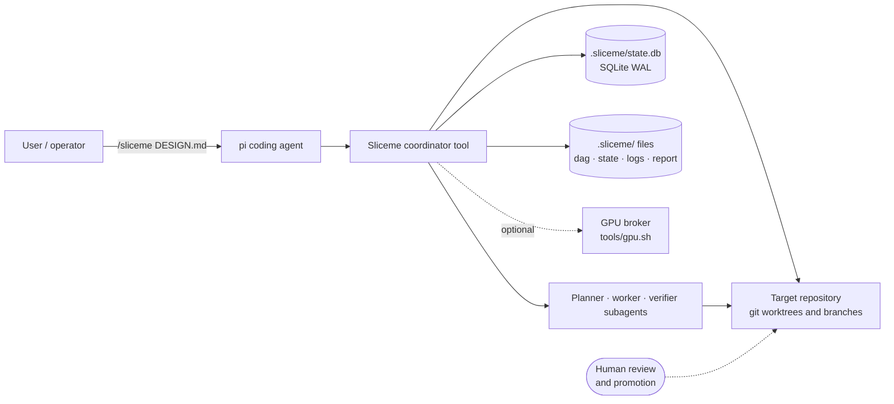
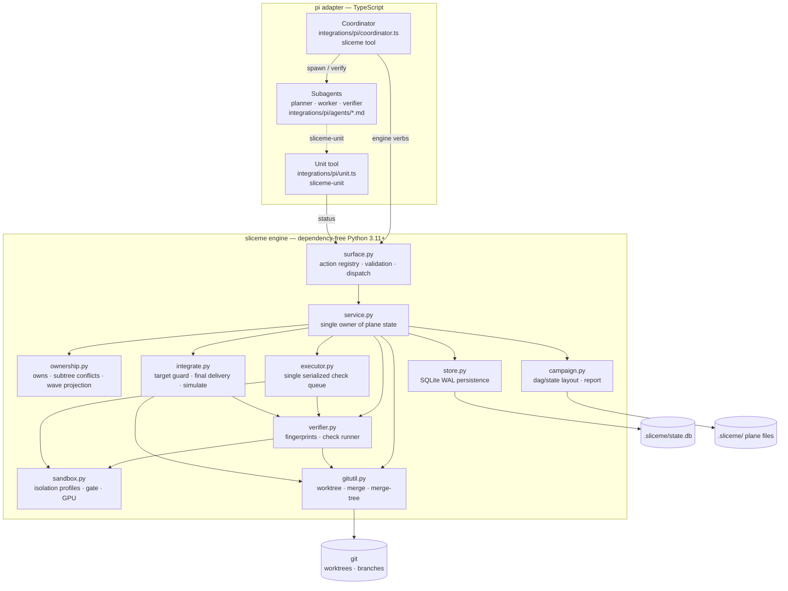
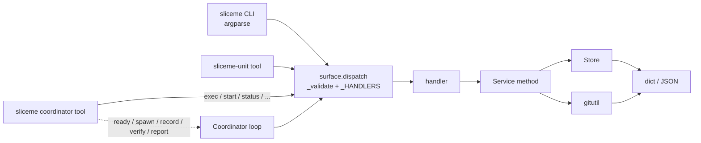
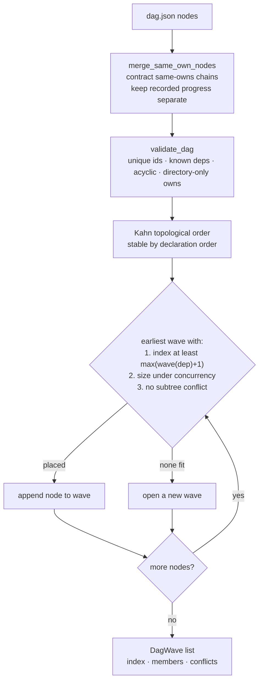
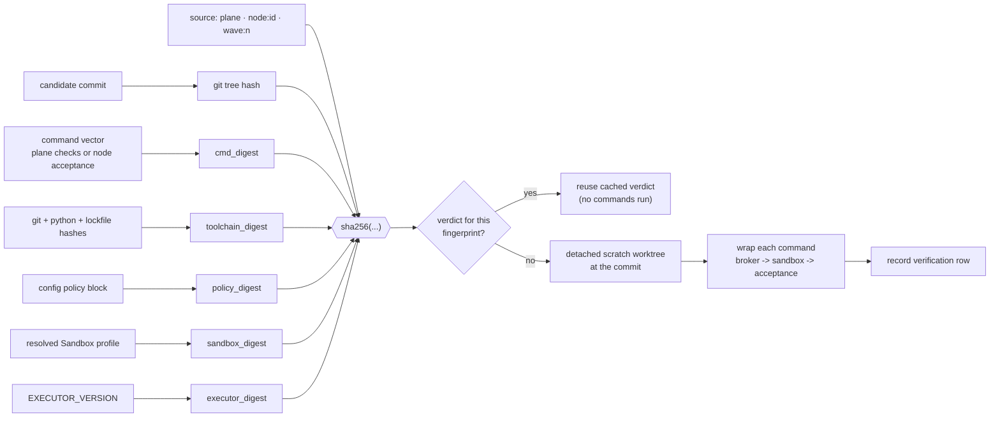
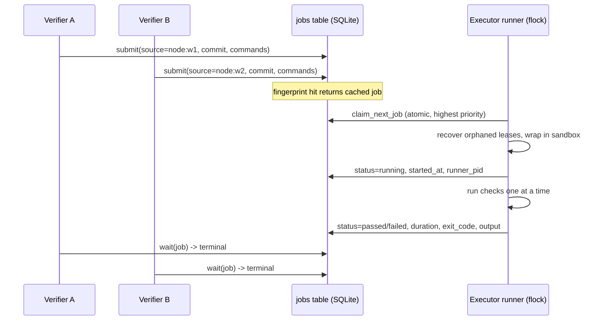
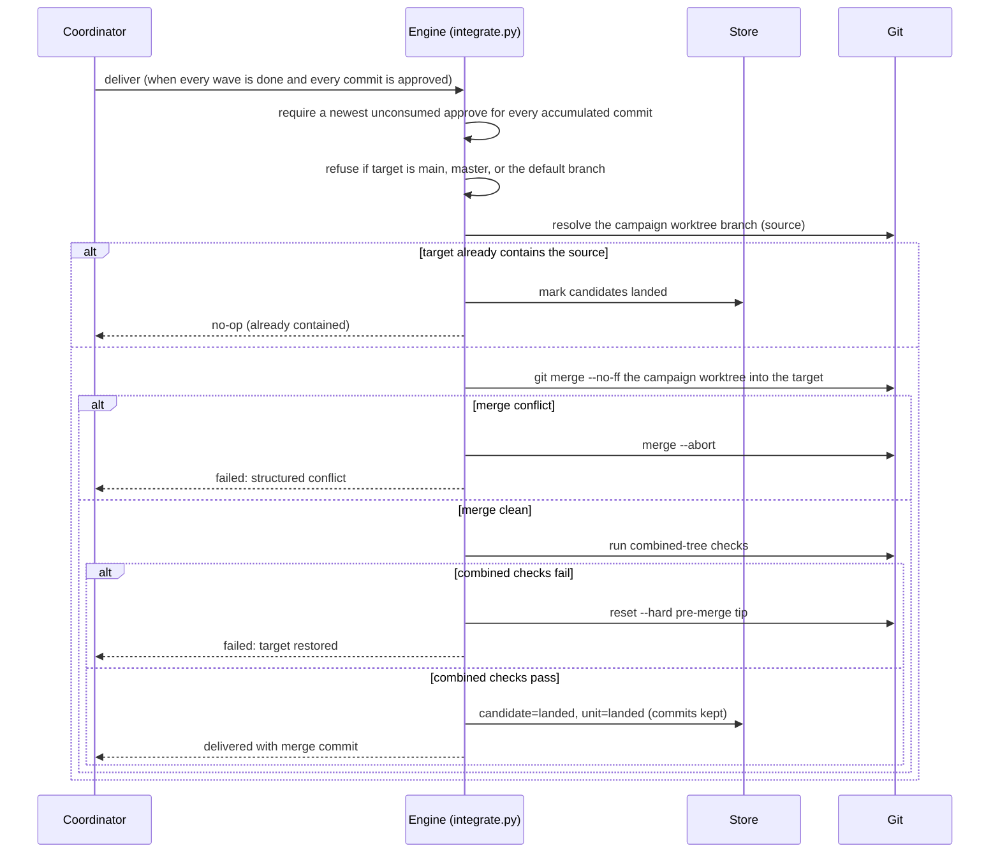
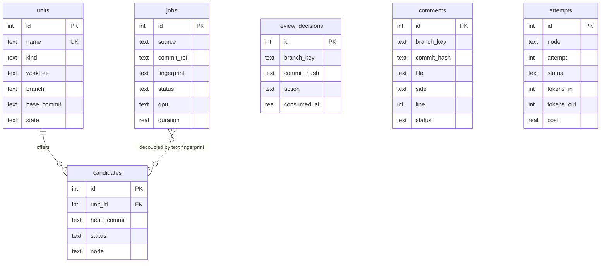
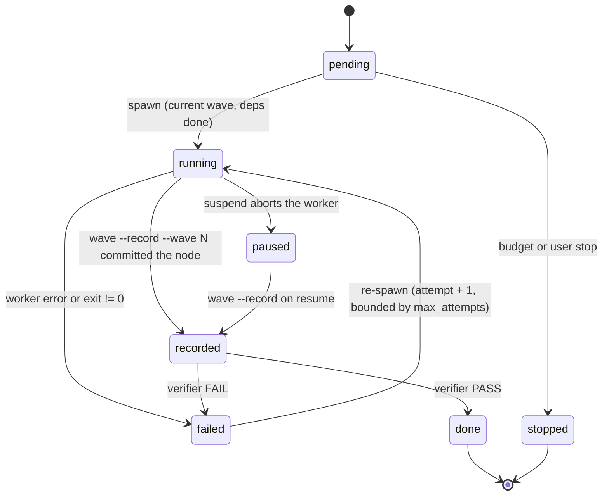

# Sliceme architecture

Status: current.

This document describes the parts of Sliceme: the actors, the engine layers,
the campaign lifecycle, the waves, verification, delivery, and state. It is a
map for contributors and operators. The normative details live in these
documents:

- [reference.md](./reference.md) — actions, modules, and state layout.
- [guide.md](./guide.md) — the model, ownership, and orchestration.
- [database.md](./database.md) — the SQLite schema and row lifecycle.
- [workflow.md](./workflow.md) — the campaign loop and the worker contract.

An interactive version of the part diagram with pan and zoom, focus, and
dark/light themes is at [architecture.html](./architecture.html). The source is
[architecture.diagram.json](./architecture.diagram.json).

## 1. In one paragraph

Sliceme turns a design document into a DAG of work. It packs non-conflicting
nodes into waves. It runs one pure-editor worker subagent per node in a single
campaign worktree. One sandboxed executor verifies each candidate against a
content fingerprint. Sliceme then delivers the campaign worktree onto a target
feature branch in one approved merge.

A pi coordinator session owns the campaign loop. A dependency-free Python
engine owns state, isolation, and delivery. The DAG (`dag.json`) is the only
authored schedule, and waves are a pure projection of it.

## 2. Design principles and invariants

| Principle | Consequence in the code |
|---|---|
| **One engine, many adapters.** | `sliceme/surface.py` is the single action registry. `sliceme/cli.py` is generated from it; the pi tools forward to the CLI. A "surface parity" test asserts the pi action list equals `surface.ACTIONS`. |
| **The engine owns state.** | `Service` is the only owner of plane state; adapters parse arguments and render results. The pi extension never writes the database or the DAG. |
| **The DAG is the only schedule.** | `phase` is a display label. Waves are derived from `owns` + `depends_on` + `concurrency` by `ownership.plan_dag_waves`. |
| **Ownership is plan-time and directory-based.** | A node declares the deepest directories it will touch (`owns`). Subtree overlap serializes nodes into different waves. `wave --record` enforces this at runtime (plan conformance). |
| **One executor.** | All checks go through one runner behind a `flock`, so shared resources (and the GPU) are serialized. Verifiers judge recorded evidence; they do not run commands. |
| **Verification is pinned to content.** | A verdict is valid only for an exact `(tree, command vector, toolchain, policy, sandbox, executor, source)` fingerprint. |
| **Git and SQLite win over caches.** | `state.json` is a rebuildable cache. On conflict, git and `state.db` are authoritative. |
| **Fail closed, fail lastingly.** | A dirty integration worktree, a missing sandbox gate, or a default-branch target aborts before mutation; a failed merge or check resets the target branch. |

## 3. System context

Who and what Sliceme talks to:



- **pi** is the only supported host today. The engine itself is host-agnostic:
  anything that can invoke the CLI gets the same behavior.
- The **target repository** is the product being built. Sliceme mutates it only
  through `git` operations (worktrees, commits, merges). Sliceme never commits
  its own plane files: it adds `.sliceme/` to the repository's
  `.git/info/exclude`.
- **Promotion to the default branch is a human `git` step.** The engine refuses
  to deliver onto `main`, `master`, or the recorded default branch, with no
  override.

## 4. Layered part view



The direction of dependency is always **downward**: surface → service → domain
modules → persistence and git. No domain module imports an adapter, and no
adapter owns state.

### Module responsibilities

| Module | Responsibility |
|---|---|
| `sliceme/surface.py` | **Single source of truth**: the action registry, parameter validation, and dispatch. |
| `sliceme/cli.py` | Generated `argparse` CLI; human and `--json` output. |
| `sliceme/service.py` | **Single owner of state**: sessions, units, candidates, wave conformance, delivery, and review. |
| `sliceme/store.py` | SQLite (WAL) persistence; additive migrations. |
| `sliceme/gitutil.py` | Git plumbing: worktree, merge, merge-tree, branch, head. |
| `sliceme/ownership.py` | Directory ownership normalization and the DAG wave projection. |
| `sliceme/verifier.py` | Fingerprints and the sandboxed trusted-check runner. |
| `sliceme/sandbox.py` | Isolation profiles, project manifests, the gate, and command wrapping. |
| `sliceme/executor.py` | The single sandboxed executor queue (submit/run/wait/cancel, dedupe, leases). |
| `sliceme/integrate.py` | Target-branch guard, final delivery, and combined-tree simulation. |
| `sliceme/campaign.py` | `dag.json` / `state.json` layout and readers; deterministic report. |
| `integrations/pi/*.ts` | pi adapter: `runSliceme`, `runSubagent`, the two tools, agent allowlists. |
| `integrations/pi/agents/*.md` | Planner, worker, and verifier prompts plus their `tools:` scoping. |

## 5. The action surface and the request path

The engine owns the actions in `surface.ACTIONS`. The pi coordinator adds the
orchestration verbs `ready`, `spawn`, `record`, `verify`, and `report`; these
verbs drive the engine and the DAG rather than adding engine actions.



| Action | Purpose |
|---|---|
| `start` (alias `init`) | Bootstrap the plane and a unit for the current directory (idempotent). |
| `status` | Units, candidates, waves, health, simulation; `--sessions` and `--resume` cover the campaign registry and resume plan. |
| `deliver` | Merge the campaign worktree into the target feature branch when every commit is approved. |
| `exec` | The single sandboxed executor queue. |
| `wave` | The campaign worktree: `--open` or `--record --wave N`. |
| `attempt` | Record one subagent attempt's begin/end and metrics. |
| `review` | Local review: serve the browser client, read a snapshot, poll comments, approve/reject commits, or write the report. |

To add an action: define it once in `surface.ACTIONS`, implement a handler and a
`Service` method, and add the name to `integrations/pi/unit.ts::SLICEME_ACTIONS`.
The CLI and the parity test follow automatically.

## 6. The campaign lifecycle

```mermaid
sequenceDiagram
  autonumber
  actor U as User
  participant C as Coordinator
  participant P as Planner
  participant W as Worker (per node)
  participant X as Executor
  participant V as Verifier
  participant E as Engine (Service)
  participant G as Git

  U->>C: /sliceme DESIGN.md
  C->>E: start --no-unit --target feature-branch
  C->>E: wave --open (campaign worktree)
  C->>P: start (planner subagent)
  P->>P: writes the campaign dag.json (Write tool)
  C->>E: status (normalizes the DAG, then projects dag_waves)
  loop each ready node in the current wave
    C->>W: spawn node (pure editor, campaign worktree)
    W->>G: edit owned dirs only
  end
  C->>E: wave --record --wave N (per-node commits, conformance)
  C->>X: verify node (submit acceptance at the node commit, run, wait)
  X->>X: run sandboxed checks in scratch worktree
  C->>V: verify against recorded evidence
  V-->>C: VERDICT: PASS / FAIL
  C->>C: mark node done (no merge); open wave N+1 in the same worktree
  U->>E: review --decision approve --commit SHA (per commit, any time)
  C->>E: report (deterministic skeleton + narrative)
  C->>E: deliver when every commit is approved (merge --no-ff into the target)
```

The coordinator is **not** a unit. The plane starts with `--no-unit`, so the
coordinator's checkout holds no phantom worktree. Workers are child processes of
the coordinator, and the coordinator does not detach them. A coordinator crash
therefore kills them. On resume, a node left `running` resets and re-spawns.

## 7. From DAG to waves

`dag.json` is canonical and is never committed. A wave is the largest set of
nodes that may run concurrently without conflicting on owned directories. The
planner authors coarse nodes; the engine then contracts any remaining
same-ownership chain into one node.



| Rule | Definition |
|---|---|
| `wave(n)` | `max(wave(d) + 1 for d in depends_on)`, then the earliest wave with room under `concurrency` and no directory-subtree conflict. |
| `ready(n)` | Every dependency is `done` (verified **and** recorded) and `n` is in the current wave. |
| `owns` conflict | Equal directories, or one an ancestor of the other. `dir:src/api` overlaps `dir:src` and `dir:src/api/v2`. |

Every wave records onto the same campaign worktree. A later wave therefore sees
the files of the previous wave without a merge or a rebase. Sliceme defers the
merge to the target branch to the single `deliver` step. `state.json` caches the
projected waves. A planner change that alters `owns` or `depends_on` changes the
DAG fingerprint and triggers a replan.

## 8. Verification: fingerprints and the executor

Sliceme pins every verification to a fingerprint. A verdict is valid only for
the exact inputs that produced it.



Two verification paths share this primitive:

1. **Executor path (`verify`).** A verifier submits the node's acceptance vector
   to the executor; `exec --run` drains the queue under the single lock; the
   verifier judges the recorded job. Dedupe by fingerprint means the executor
   serves an unchanged vector from cache.
2. **Delivery path (`deliver`).** The plane's trusted checks run on the merged
   campaign-worktree tree. Sliceme reuses a passed fingerprint.

`source` is part of the identity, so a `node:w1` acceptance verdict can never
collide with a plane check. Sliceme folds in the sandbox digest and the executor
version. A stricter sandbox or a change in how checks run therefore invalidates
cached verdicts.

### The single executor



- `run`/`drain` hold an exclusive `flock` on `.sliceme/executor.lock`, so no two
  check vectors run at once.
- `claim_next_job` selects the highest-priority queued job and marks it running
  in one transaction.
- A `running` job older than its lease is reset to `queued` before a drain
  (crash recovery).
- The GPU broker composes as `broker -> sandbox -> acceptance`; only the
  executor may request a GPU tier.

## 9. Delivery



Delivery is deterministic and idempotent: re-running skips a target that already
contains the campaign worktree.  For a generic non-campaign plane with no
worktree branch, `deliver` falls back to ordered per-candidate merges.  The
engine mutates the target branch only in the `_integration` worktree. The
default branch is never a valid target.

## 10. State and persistence

Everything is reconstructable from `.sliceme/` plus git. The database holds what
git and files cannot express quickly; the DAG and the coordinator cache are
files.



### Plane file layout

```text
.sliceme/
  config.json                      # version, target_branch, worktree_branch, base, default_branch, checks, policy
  state.db                         # SQLite WAL: units, candidates, jobs, attempts, review_decisions, comments
  executor.lock                    # exclusive lock held by the single executor runner
  review.lock                      # plane delivery lock (separate from executor.lock)
  <branch-key>.dag.json            # canonical plan (never committed)
  <branch-key>.state.json          # coordinator cache: node -> status, waves, sandbox digest (rebuildable)
  <branch-key>.report.md           # deterministic report (kept on cleanup)
  <branch-key>.session.json        # adapter-written suspend/resume descriptor
  <branch-key>.control.json        # cooperative pause flag
  <branch-key>.progress_<node>.json# per-node subagent heartbeat
  <branch-key>.worker_<id>.log     # one log per worker id
  <branch-key>.events.jsonl        # append-only audit log (extension)
  worktrees/                       # the single campaign worktree (+ transient unit worktrees)
  scratch/                         # detached simulation/verification worktrees (transient)
```

`<branch-key>` replaces `/` with `--` (`feat/x` → `feat--x`), so one campaign's
files form a single glob and campaigns cannot collide. `state.json` holds only
what git and `state.db` cannot express quickly; on conflict, git and `state.db`
win. The `attempts` table from [observability.md](./observability.md), and the
`review_decisions` and `comments` tables from [review.md](./review.md), are
implemented. The suspend/resume descriptor is a file, not a table.

## 11. Concurrency, failure, and recovery



| Failure | Engine response |
|---|---|
| Worker produces no candidate / fails acceptance | Node `failed`; coordinator retries within `max_attempts`, splits, or stops. |
| Verifier `fail` | Node `failed`; the verifier's evidence is attached to the retry prompt. |
| A wave record touches a path outside every node's `owns` | Rejected by plan conformance; the coordinator widens `owns` or adds a `depends_on` edge; waves replan. |
| Merge conflict at `deliver` | Merge aborted; structured findings returned; the target branch is never half-merged. |
| Combined checks fail after merge | Target branch reset to its pre-merge tip; candidates not landed. |
| Default-branch target | Refused at `start` and at `deliver`; there is no override. |
| Orchestrator crash | Non-detached workers die. On resume, `running` and `recorded` nodes become `paused` if the campaign worktree is present, else `pending`. Sliceme reuses the campaign worktree. Expired executor leases requeue. |
| Concurrent spawns completing together | Coordinator state is a rebuildable cache; git and `state.db` are the source of truth. (The proposed single-writer state store in [observability.md](./observability.md) §9, suggestion 2, removes the read-modify-write race.) |

Bounding knobs: `concurrency` (wave size), `max_attempts` per node, per-command
timeouts, and the executor's single-runner serialization.

## 12. Package and extension layout

```text
sliceme/
  bin/sliceme                 # portable shim; runs the bundled CLI without installation
  sliceme/                    # dependency-free Python engine (see §4)
  integrations/pi/
    common.ts                 # runSliceme, runSubagent, state paths, JSON helpers
    coordinator.ts            # `sliceme` campaign tool + /sliceme command
    unit.ts                   # `sliceme-unit` worker tool
    agents/{planner,worker,verifier}.md
  docs/                       # guide, reference, workflow, database, architecture, ...
  tests/                      # unittest suite (waves, scopes, executor, e2e, CLI, packaging)
  tools/gpu.sh                # bundled GPU broker
  package.json                # pi package manifest (extensions: unit.ts, coordinator.ts)
  pyproject.toml
```

The pi tools register **inactive**; `/sliceme [DESIGN.md]` activates them for the
session. `runSubagent` applies each agent's `tools:` allowlist, so a worker
launched with `--tools sliceme-unit` can never see the coordinator tool. This is
the enforcement point for "workers own their node; only the coordinator owns the
campaign".

## 13. Diagram index

| Diagram | Type | In this document |
|---|---|---|
| Component architecture (interactive) | architecture | [architecture.html](./architecture.html) |
| System context | flowchart | §3 |
| Layered components | flowchart | §4 |
| Request path / action surface | flowchart | §5 |
| Campaign lifecycle | sequence | §6 |
| DAG → waves | flowchart | §7 |
| Fingerprint and verification | flowchart | §8 |
| Executor queue | sequence | §8 |
| Integration and landing | sequence | §9 |
| Entity relationships | ER | §10 |
| Node state machine | state | §11 |

## 14. Related documents

- [guide.md](./guide.md) — the model, ownership, orchestration, and agent roles.
- [reference.md](./reference.md) — actions, modules, state layout, verification, tests.
- [workflow.md](./workflow.md) — the campaign loop and the worker contract.
- [database.md](./database.md) — the SQLite schema and row lifecycle.
- [observability.md](./observability.md) — run visibility and timing/agent metrics (partly implemented).
- [sessions.md](./sessions.md) — suspend and resume, checkpoints, and the campaign registry.
- [review.md](./review.md) — the local review client, server, and per-commit approval gate.
- [publishing.md](./publishing.md) — packaging and release.
