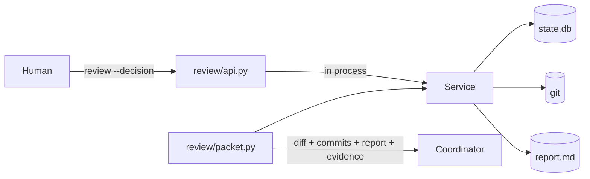

# Sliceme campaign review

Status: implemented. Commits accumulate while the campaign runs. A human
approves the whole campaign commit set. Sliceme includes the report even though
git ignores it.

A human reviews the unmerged commits from the campaign worktree. The reviewer
reads the diff and the report, then approves or requests changes on the
campaign. The design has one safety goal: **no pull request without a human
approval of the campaign.**

## 1. Scope

In:

- One campaign-level approval for the whole commit set.
- Review of the accumulated campaign commits, at any time, before or after the
  last wave.
- The generated report (`.sliceme/<branch-key>.report.md`), even though it is
  git-ignored, shown as a virtual file next to the diff.
- The check evidence for each reviewed commit.
- A non-blocking review: workers never wait for the human, and the coordinator
  proceeds after a human approves the campaign.
- Several campaigns in one plane, scoped by `--campaign`.

Out:

- A browser client, a review server, and its trust boundary.
- Comments, replies, and the comment lifecycle.
- Per-commit approval.
- Remote or shared review.
- Uncommitted working-tree changes. The review unit is commits.
- Promotion from the target feature branch to the default branch. That step
  stays a human act on the forge.

## 2. Architecture



The `sliceme/review/` package keeps three modules:

| Module | Responsibility |
|---|---|
| `api.py` | Dispatch for the two review actions: `decision` and `report`. |
| `packet.py` | The snapshot: accumulated commits, the report, the evidence, and `campaign_branch_key`. |
| `diff.py` | Diff parsing and the file index. |

`Service` stays the only owner of state. The packet reads git and the report
file, so the review surface adds no second store.

## 3. Review model

- The review unit is the campaign worktree. Commits accumulate as waves land.
- A review packet is the diff `target_tip...source_tip`, the commit list, the
  report, and the check evidence.
- The packet reads the diff from git and the report from disk.
- The reviewer approves or requests changes on the whole campaign commit set.
- One approval is one row keyed by `(branch_key, commit_hash)` with a null
  `commit_hash`. The newest unconsumed campaign decision wins, and a
  `request_changes` supersedes an earlier `approve`. An `override` stays a
  separate campaign-level decision.

The **report** is a virtual file. It is git-ignored, so it is not a commit. The
packet carries its path, its content, and its update time. The report is
evidence for the reviewer, never a merge gate.

The **evidence** is the newest check for each commit. The row holds the status,
the duration, the fingerprint, the command vector, and the output. Evidence is
the main reason to read the packet.

Review is **incremental and non-blocking**. A human can review after the first
commit and approve as work lands. Workers keep editing; nothing waits on the
review. The coordinator opens the pull request only after a human approves the
campaign.

## 4. State

One table in `.sliceme/state.db` follows the existing `CREATE TABLE IF NOT
EXISTS` pattern.

**`review_decisions`** — `branch_key`, `commit_hash`, `action`, `actor`,
`note`, `created_at`, `consumed_at`. Append-only. A campaign-level decision uses
a null `commit_hash`; the newest unconsumed decision wins. The table also keeps
the superseded rows, so the decision history stays auditable.

`gc` prunes rows for campaigns whose branch and delivery are gone and older than
a retention window (`policy.review_retention_days`, default 30). It keeps every
key in the campaign registry, every descriptor file, and the current campaign,
so an active review never disappears.

## 5. The approval gate

Delivery proceeds only when the newest campaign decision is an unconsumed
`approve`, or a campaign-level `override` records a note. Otherwise delivery
refuses with a `not-approved` finding. The engine never asks for approval again
on its own.

- A `request_changes` campaign decision supersedes an earlier `approve`.
- A successful delivery consumes the campaign decision it used. A failed check
  or a failed forge call leaves the decision unconsumed, so a retry needs no new
  review.

The coordinator does not prompt for a final approval. The human decision is the
trigger. When a human approves the campaign and every wave has completed, the
coordinator runs `deliver`.

## 6. The report

```bash
sliceme review --report [--narrative TEXT] [--design REF]
```

`review --report` writes `.sliceme/<branch-key>.report.md`. The skeleton is
deterministic: the design reference, the feature branch, the nodes, the
candidates, and the newest check per candidate. `--narrative` appends the
coordinator's summary. The report is the body of the delivery pull request.

## 7. Delivery

The coordinator triggers delivery after every wave completes and a human approves
the campaign. The design orders delivery to avoid a race with the campaign loop:

1. **Quiesce.** The resource records and checks one wave at a time, so no worker
   commits mid-delivery.
2. **Lock.** Take the plane delivery lock at `.sliceme/review.lock`.
3. **Re-check the gate** under the lock and immediately before the push.
4. Push the campaign branch, open the pull request, mark the candidates landed,
   and consume the decision.

Preconditions, enforced in `Service`:

- every wave reaches done, or an `override` decision records a note;
- the campaign worktree has no uncommitted changes;
- the target worktree is clean;
- a human approved the campaign, or an override records a note;
- if `policy.require_verification`, no candidate is `failed` or `blocked`,
  unless an override records a note.

Override is a human decision, not an agent action.

## 8. Concurrency

- **Schema once.** Startup opens each plane's `Store` once to run `SCHEMA` and
  `_migrate`, then closes it.
- **Lock order.** The plane delivery lock, then the campaign lock, then SQLite
  row locks.

`review` joins `ACTIONS`. Recording a decision and writing the report are both
agent-callable, but a human owns the approval decision.

## Related

- [guide.md](./guide.md) — the model, ownership, and orchestration.
- [architecture.md](./architecture.md) — layered parts and the campaign lifecycle.
- [reference.md](./reference.md) — actions, modules, state layout, and gaps.
- [database.md](./database.md) — the SQLite schema and row lifecycle.
- [workflow.md](./workflow.md) — the campaign loop and the worker contract.
- [sessions.md](./sessions.md) — suspend and resume.
