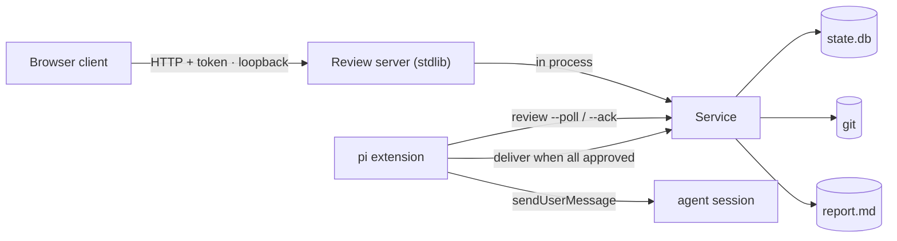

# Sliceme local review design

Status: implemented. Commits accumulate while the campaign runs. A human
approves them one by one or all at once. Sliceme includes the report even though
git ignores it. The coordinator proceeds to delivery automatically once a human
approves every commit.

A human reviews the unmerged commits from the campaign worktree in a local
browser. The reviewer reads the diff and the report, writes comments, and
approves or rejects individual commits. The design has one safety goal: **no
merge without a human approval of every reviewed commit.**

## 1. Scope

In:

- A local browser client and a Python standard-library server, both in the
  package.
- Review of the accumulated campaign commits, at any time, before or after the
  last wave.
- The generated report (`.sliceme/<branch-key>.report.md`), even though it is
  git-ignored, shown next to the diff.
- One approval per commit, plus "approve all".
- Comments that attach to a commit, the report, a file, and a line range.
- The verification evidence for each reviewed commit.
- A non-blocking review: workers never wait for the human, and the coordinator
  proceeds automatically when a human approves every commit.
- Several planes under configured roots.

Out:

- Remote or shared review. The server binds to loopback only.
- Promotion from the target feature branch to the default branch. That step
  stays a human `git` step.
- Uncommitted working-tree changes. The review unit is commits.
- More than one concurrent campaign per plane.
- Windows. The design uses POSIX locks.

## 2. Architecture



The server calls `Service` in process. It does not call `bin/sliceme`. So
`deliver`, the target guard, `run_checks`, the conflict reset, and cleanup need
no JSON contract to stay in sync. `Service` stays the only owner of state.

The relay is a queue in the database, not a mailbox. The server writes comments
to SQLite. The extension asks the engine for work. So the extension never opens
the database.

New modules live under `sliceme/review/`: `server.py`, `api.py`, `packet.py`,
`diff.py`, `security.py`, and the `web/` static files. The assets ship with the
existing npm `files` entry.

## 3. Review model

- The review unit is the campaign worktree. Commits accumulate as waves land.
- A review packet is the diff `target_tip...source_tip`, the commit list, the
  report, the comments, and the verification evidence.
- The server reads the diff from git and the report from disk.
- The reviewer approves or rejects one commit at a time, or approves every
  unapproved commit at once.
- An approval is one row keyed by `(branch_key, commit_hash)`. The newest row
  for a commit wins.

The **report** is a virtual file. It is git-ignored, so it is not a commit. The
packet carries its path, its content, and its update time. The reviewer can read
it and comment on it. The report is evidence for the reviewer, never a merge
gate.

The **evidence** is the newest verification for each commit. The row holds the
status, the duration, the fingerprint, and the output. Evidence is the main
reason to open the review page.

Review is **incremental and non-blocking**. A human can open the page after the
first commit and approve as work lands. Workers keep editing; nothing waits on
the review. The coordinator merges only when every accumulated commit is
approved.

## 4. State

Two additive tables in `.sliceme/state.db`, following the existing
`CREATE TABLE IF NOT EXISTS` and `_migrate` pattern.

- **`review_decisions`** — `branch_key`, `commit_hash`, `action`, `actor`,
  `note`, `created_at`, `consumed_at`. Append-only. The newest row for a commit
  wins. A null `commit_hash` is a campaign-level `override`.
- **`comments`** — `branch_key`, `commit_hash`, `file`, `side`, `line`,
  `line_end`, `body`, `node`, `status`, `created_at`, `addressed_at`. Status is
  `open`, `delivered`, or `addressed`.

The design writes audit events to `.sliceme/<branch-key>.events.jsonl`. The
design adds no relay audit table.

Comments stay in SQLite. An optional export writes a portable copy as a git
note on the commit. Notes are mutable, so SQLite remains the queue.

`gc` prunes rows for campaigns whose branch and merge commit are gone and older
than a retention window. It never prunes a campaign with a descriptor file.

## 5. Comments and the relay

Comments must reach the coordinator session. The design uses a simple poll and
acknowledge cycle.

1. The `comment` action inserts a row with status `open`.
2. The extension runs `sliceme review --poll` at session start, between waves,
   and on a timer.
3. The poll returns the open comments, the unapproved commits, and whether a
   human approves every commit.
4. The extension sends each comment to the session with `pi.sendUserMessage`.
5. The extension runs `sliceme review --ack --comment <id>` for each comment.
   The ack sets the status to `delivered`.

A duplicate comment is safe. A lost comment is not. The design delivers at
least once, so a crash repeats a comment at most.

The design does not use a lease. A lease adds rows and timers. At-least-once
delivery gives the same safety with less code.

Routing targets the coordinator session from `<branch-key>.session.json`. Node
attribution is bundle metadata, not a routing decision.

## 6. The approval gate

Delivery proceeds only when every commit in the packet has a newest, unconsumed
`approve`, or a campaign-level `override` records a note. Otherwise delivery
refuses with a `not-approved` finding. The engine never asks for approval again
on its own.

- A new commit starts unapproved, so a later commit re-opens the gate. An
  approval can never outlive the diff it approved.
- A `request_changes` row for a commit supersedes an earlier `approve` for that
  commit.
- A successful merge consumes every approval it used. A failed check run resets
  the target and leaves the approvals unconsumed, so a retry needs no new
  review.

The coordinator does not prompt for a final approval. The browser approvals are
the trigger: when `review --poll` reports that a human approves every commit and
every wave has completed, the coordinator runs `deliver`.

## 7. HTTP surface

The client needs one coherent snapshot, one file diff, and one write path.
Three routes cover the page.

| Method | Path | Purpose |
|---|---|---|
| GET | `/` | static client |
| GET | `/api/state` | one review snapshot |
| GET | `/api/diff` | one file diff, loaded on demand |
| POST | `/api/action` | run one review action |

Query parameters:

- `/api/state?plane=<plane>&commit=<sha>`
- `/api/diff?plane=<plane>&commit=<sha>&file=<path>`

The snapshot returns the plane list, the pinned tips, and the commit list with
its approval state. It also returns the file index, the report, the comments, and
the verification evidence. The client polls this route every few seconds. The
design uses no Server-Sent Events, so it needs no stream token and no replay
logic.

The action route accepts a JSON body: `{"action": "...", "params": {...}}`. The
route accepts only three actions: `comment`, `decision`, and `deliver`. The
server validates each action and dispatches it to `Service`. This pattern
mirrors `surface.dispatch`, so the HTTP adapter stays thin and every action
stays agent-callable.

## 8. The user interface

The client is one page. It has a top bar and three panes.

```text
+--------------------------------------------------------------------+
| sliceme review · feat/x · tips 1a2b3c -> 9f8e7d   [Approve all]    |
+--------------+----------------------------------+------------------+
| Commits      | diff                             | Review           |
| ✓ 1a2b3c add | @@ -10,7 +10,9 @@                | ▾ Evidence       |
| ○ 9f8e7d fix | 10  def handle(req):             |   passed · 12.4s |
| Files        | 11 +    token = read()           |   fp 3f9c...     |
|   server.py  | 12 +    return token             | ▾ Comments (2)   |
|   report     |                                  |   server.py:11   |
+--------------+----------------------------------+------------------+
| 3 files · 16 additions · 0 deletions · abc123 · updated 2s ago     |
+--------------------------------------------------------------------+
```

- **Top bar.** The feature branch, the two tips, the approval state, and
  **Approve all**.
- **Left pane.** The commit list with an approval toggle per commit, then the
  files of the selected commit and the report.
- **Center pane.** The diff, or the report text.
- **Right pane.** The evidence and the comment list.

### 8.1 Selecting a commit, a file, and a line

- **Commit.** The left pane holds the accumulated commit list. Each row shows an
  approval toggle, a short hash, and the subject. The default is the newest
  commit.
- **File.** The left pane holds a file tree for the selected commit. A file row
  shows the path, the status, and the addition and deletion counts. A click
  loads that file diff from `/api/diff`.
- **Report.** The left pane holds a report row when a report exists. A click
  shows the report text in the center pane.
- **Line.** A click on a diff line or a line number sets the anchor. A blue band
  marks the anchor. A shift-click extends the anchor to a range.
- The client writes the selection to `location.hash`. A reload then restores the
  view. The hash holds the plane, the commit, the file, and the report flag.

### 8.2 Writing a comment

1. Move the pointer over a diff line. A `+` button appears in the gutter.
2. Click the `+` button, or press `c` on the focused line.
3. A text box opens.
4. Type the comment body.
5. Press `Ctrl+Enter`, or click **Comment**. Press `Esc` to cancel.

The client sends the `comment` action with the anchor. The anchor holds the
commit, the file, the side, the line, and the line end. A deleted line anchors
to the `old` side. An added or context line anchors to the `new` side. The
server stores the anchor with the body. A comment on the report leaves the
commit empty.

A saved comment shows a marker in the gutter. A click on the marker opens the
comment thread.

### 8.3 Recording an approval

- The left pane holds one toggle per commit. A click approves the commit, or
  requests changes on an approved commit.
- The top bar holds **Approve all**, which approves every unapproved commit.
- **Request changes** needs a note, or at least one open comment.
- **Override** is an advanced option at the campaign level. It needs a note.
- The engine records the commit hash the client shows, so the approval binds to
  the reviewed commit.

### 8.4 Evidence panel

The right pane shows the newest verification for the selected commit. It holds
the status, the command vector, the duration, the fingerprint, and the output.
A click on the fingerprint copies the full value.

### 8.5 Staleness

The client polls `/api/state` every few seconds. If the tips differ from the
packet tips, the top bar shows **stale**. The client then disables the approval
controls. The reviewer reloads the packet to continue.

### 8.6 Rendering and accessibility

- The client writes diff text, report text, and comment text with `textContent`.
  It never writes HTML from plane data.
- The Content Security Policy forbids inline script and remote script.
- A status uses a text label and a color. A color alone never carries meaning.
- Focus rings stay visible. The Tab key reaches each pane.

### 8.7 Static files

The client has no build step. The server serves four fixed files from the
package:

- `web/index.html`
- `web/app.js` — state, polling, and the action calls
- `web/diff.js` — diff rendering and line anchoring
- `web/style.css`

The server sends the diff as JSON. Each line holds a type, an old line number, a
new line number, and the text. The client renders the lines. The file index
keeps the first load small, and the client loads one file at a time. The report
travels in the snapshot because it is one small Markdown file.

## 9. Delivery

The coordinator triggers delivery after every wave completes and a human
approves every commit. The design orders delivery to avoid a race with the
campaign loop:

1. **Quiesce.** The poll runs only while the agent is idle, so no worker commits
   mid-delivery.
2. **Lock.** Take the plane delivery lock at `.sliceme/review.lock`. This lock
   is separate from `executor.lock`.
3. **Re-check the gate** under the lock and immediately before the merge.
4. Merge `--no-ff`, run `run_checks`, reset the target on failure, mark the
   candidates landed, consume the approvals, and clean up.

Preconditions, enforced in `Service`:

- every wave is `done`, or an `override` decision records a note;
- the campaign worktree has no uncommitted changes;
- the target worktree is clean;
- a human approved every reviewed commit, or an override records a note;
- if `policy.require_verification`, no candidate is `failed` or `blocked`,
  unless an override records a note.

Override is a human decision, not an agent action.

## 10. Concurrency

- **Schema once.** Startup opens each plane's `Store` once to run `SCHEMA` and
  `_migrate`, then closes it. Requests never re-run migrations.
- **Thread-local `Service`.** `Store` uses
  `sqlite3.connect(..., check_same_thread=True)`. Each request thread gets its
  own `Service` and `Store` per plane through `threading.local`.
- **Lock order.** Plane delivery lock, then the per-plane `Service` lock, then
  SQLite row locks.

`review` joins `ACTIONS` and `SLICEME_ACTIONS`. Starting the server, reading
snapshots, and polling are agent-callable. The `comment` and `decision` actions
are agent-callable too, but the UI treats them as human acts.

## 11. Security

The server can invoke `deliver`, so the boundary is explicit:

- Bind `127.0.0.1` and `::1` only.
- Mint a write token with `secrets.token_urlsafe`.
- Require the token in `X-Sliceme-Token` for each write.
- Put the token in the URL fragment. The fragment stays out of the browser
  history and the `Referer` header.
- Require `application/json` for each write. Check `Origin` and `Host` against
  the loopback origin.
- Render agent diff lines, file names, comments, and report text as text, never
  as HTML.
- Send a strict Content Security Policy. Serve only a fixed file list.
- Use no cookies and no ambient credentials.

The server runs in the foreground. The command prints the URL and stops with
Ctrl-C. The design keeps no runtime file and no pid file, so the token never
rests on disk.

## 12. Build order

1. The two tables and their `Store` methods.
2. The `Service` review methods and the all-approved gate in `Service.deliver`.
3. `diff.py` and `packet.py`, with the file index, the report, and the evidence
   join.
4. The foreground server, the security checks, and the read-only client.
5. The action route, the browser approval, and the delivery lock.
6. The `comment` action and the `review --poll` / `--ack` consumer.
7. Automatic delivery after a human approves every commit, retention, and
   cleanup.

## 13. Trade-offs and accepted risks

Gains: the server reuses the delivery path in process. Review state is
auditable and reconstructable from git plus SQLite. One install and one release.
Per-commit approval closes a race that a single tip pin could not, and it lets
review start early. The queue adds no broker and no second store. The small
route set keeps the adapter thin.

Costs: a server and a browser trust boundary in a package with no dependencies.
An explicit concurrency model. A larger test surface.

Accepted risks:

- A human can change the worktree or branch with `git` during a review. A new
  commit starts unapproved, so the gate re-opens. The clean check catches a
  dirty tree. Sliceme does not own the user's shell.
- The server is POSIX only.
- A foreground server needs a terminal. The user must keep that terminal open.

Invariant: if the server writes plane state outside `Service`, the integration
loses the property that makes it clean.

## Related

- [guide.md](./guide.md) — the model, ownership, and orchestration.
- [architecture.md](./architecture.md) — layered parts and the campaign lifecycle.
- [reference.md](./reference.md) — actions, modules, state layout, and gaps.
- [database.md](./database.md) — the SQLite schema and row lifecycle.
- [workflow.md](./workflow.md) — the campaign loop and the worker contract.
- [sessions.md](./sessions.md) — suspend and resume, which the poll action builds on.
