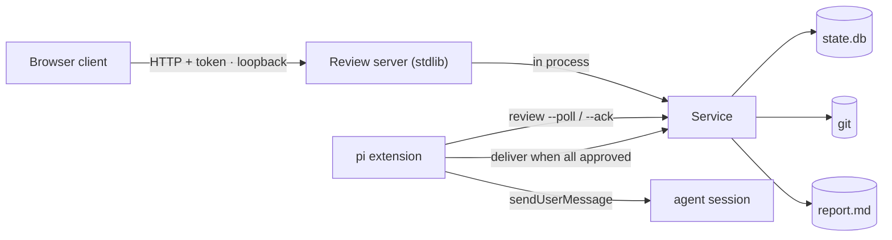

# Sliceme local review design

Status: implemented. Commits accumulate while the campaign runs. A human
approves the whole campaign commit set. Sliceme includes the report even though
git ignores it. The coordinator proceeds to delivery automatically once a human
approves the campaign and has addressed every delivered comment.

A human reviews the unmerged commits from the campaign worktree in a local
browser. The reviewer reads the diff and the report, writes comments, and
approves or requests changes on the campaign. The design has one safety goal:
**no
pull request without a human approval of every reviewed commit.**

## 1. Scope

In:

- A local browser client and a Python standard-library server, both in the
  package.
- Review of the accumulated campaign commits, at any time, before or after the
  last wave.
- The generated report (`.sliceme/<branch-key>.report.md`), even though it is
  git-ignored, shown next to the diff.
- One campaign-level approval for the whole commit set.
- Comments that attach to a commit, the report, a file, and a line range.
- Replies under a comment, with an optional addressing commit.
- The comment-addressing status: `open`, `delivered`, `addressed`.
- The verification evidence for each reviewed commit.
- A non-blocking review: workers never wait for the human, and the coordinator
  proceeds automatically when a human approves the campaign.
- Several planes under configured roots.
- Several campaigns in one plane, with a campaign selector in the client.

Out:

- Remote or shared review. The server binds to loopback only.
- Promotion from the target feature branch to the default branch. That step
  stays a human act on the forge.
- Uncommitted working-tree changes. The review unit is commits.
- Windows. The design uses POSIX locks.

## 2. Architecture



The server calls `Service` in process. It does not call `bin/sliceme`. So
`deliver`, the target guard, `run_checks`, and cleanup need
no JSON contract to stay in sync. `Service` stays the only owner of state.

The pi extension starts the server as a background child after the first
recorded commit. The extension shows the URL in a widget. The extension stops
the child after a successful delivery and on session shutdown. The CLI starts
the same server in the foreground. The engine opens the default browser when one
is available.

Server lifecycle:

- The first recorded commit starts the server.
- A successful delivery stops the server. Delivery opens a pull request for
  every approved commit.
- `session_shutdown` stops the server.
- The server stops itself when the parent closes the pipe on standard input. A
  crashed coordinator therefore cannot leave an orphan server.
- The URL file name carries the coordinator process id. The file is
  `.sliceme/review.<pid>.url`. Two sessions in one checkout do not collide.

The relay is a queue in the database, not a mailbox. The server writes comments
to SQLite. The extension asks the engine for work. So the extension never opens
the database.

New modules live under `sliceme/review/`: `server.py`, `api.py`, `packet.py`,
`diff.py`, `security.py`, and the `web/` static files. The assets ship with the
existing npm `files` entry.

## 3. Review model

- The review unit is the campaign worktree. Commits accumulate as waves land.
- A review packet is the diff `target_tip...source_tip`, the commit list, the
  report, the comments, and the verification evidence.
- The server reads the diff from git and the report from disk.
- The reviewer approves or requests changes on the whole campaign commit set.
- An approval is one row keyed by `(branch_key, commit_hash)` with a null
  `commit_hash`. The newest unconsumed campaign decision wins, and a
  `request_changes` supersedes an earlier `approve`. An `override` stays a
  separate campaign-level decision.

The **report** is a virtual file. It is git-ignored, so it is not a commit. The
packet carries its path, its content, and its update time. The reviewer can read
it and comment on it. The report is evidence for the reviewer, never a merge
gate.

The **evidence** is the newest verification for each commit. The row holds the
status, the duration, the fingerprint, and the output. Evidence is the main
reason to open the review page.

Review is **incremental and non-blocking**. A human can open the page after the
first commit and approve as work lands. Workers keep editing; nothing waits on
the review. The coordinator opens the pull request only when a human approves
every accumulated commit.

## 4. State

Two additive tables in `.sliceme/state.db`, following the existing
`CREATE TABLE IF NOT EXISTS` and `_migrate` pattern.

- **`review_decisions`** — `branch_key`, `commit_hash`, `action`, `actor`,
  `note`, `created_at`, `consumed_at`. Append-only. A campaign-level decision
  uses a null `commit_hash`; the newest unconsumed decision wins.
- **`comments`** — `branch_key`, `commit_hash`, `file`, `side`, `line`,
  `line_end`, `body`, `node`, `status`, `parent_comment_id`,
  `addressing_commit`, `created_at`, `addressed_at`. Status is `open`,
  `delivered`, or `addressed`.

A **reply** is a row in `comments` with a `parent_comment_id` and a status of
`addressed` when recorded. It carries `addressing_commit` only when it answers
with code; a no-code conversation turn leaves it null. A reply never changes
the parent status. A **root** comment moves `open` -> `delivered` ->
`addressed`, and Sliceme stamps `addressed_at` when the comment becomes
`addressed`.

The design writes audit events to `.sliceme/<branch-key>.events.jsonl`. The
design adds no relay audit table.

Comments stay in SQLite. An optional export writes a portable copy as a git
note on the commit. Notes are mutable, so SQLite remains the queue.

`gc` prunes rows for campaigns whose branch and delivery are gone and older
than a retention window. It never prunes a campaign with a descriptor file.

## 5. Comments and the relay

Comments must reach the coordinator session. The design uses a simple poll and
acknowledge cycle.

1. The `comment` action inserts a row with status `open`.
2. The extension runs `sliceme review --poll` at session start, between waves,
   and on a timer.
3. The poll returns the open comments, the delivered comments that are not yet
   addressed, and whether a human approves the campaign.
4. The extension sends each comment to the session with `pi.sendUserMessage`.
5. The extension runs `sliceme review --ack --comment-id <id>` for each comment.
   The ack sets the status to `delivered`.

A `delivered` comment is **pending** until the addressing pass answers it. A
restart re-relays every pending comment, so the relay is idempotent. The
addressing subagent resolves the comment to a node with `review --resolve`, then
either records a reply row (`review --reply`) or marks the root comment
addressed (`review --addressed`). A root comment that resolves to no node may
only receive a reply row; it must not spawn a node.

A duplicate comment is safe. A lost comment is not. The design delivers at
least once, so a crash repeats a comment at most.

The design does not use a lease. A lease adds rows and timers. At-least-once
delivery gives the same safety with less code.

The relay targets the coordinator session from `<branch-key>.session.json`. A
dedicated addressing subagent owns one persistent session per campaign and
holds the thread context across comments. Node attribution is the engine's
`--resolve` decision, not bundle metadata.

## 6. The approval gate

Delivery proceeds only when the newest campaign decision is an unconsumed
`approve`, or a campaign-level `override` records a note. Otherwise delivery
refuses with a `not-approved` finding. The engine never asks for approval again
on its own. Delivery also refuses while any root comment is `delivered` but not
`addressed`, with an `unaddressed-comments` finding.

- A reply that answers with code records an addressing commit. That commit
  changes the reviewed diff, so it consumes the campaign approval and re-opens
  the gate. A reply-only turn keeps the approval.
- A `request_changes` campaign decision supersedes an earlier `approve`.
- A successful delivery consumes the campaign approval it used. A failed check
  or a failed forge call leaves the approval unconsumed, so a retry needs no new
  review.

The coordinator does not prompt for a final approval. The browser approvals are
the trigger. When `review --poll` reports that a human approves the campaign,
no comment remains open, and every wave has completed, the coordinator runs
`deliver`.

## 7. HTTP surface

The client needs one coherent snapshot, one file diff, one file body, and one
write path. Four routes cover the page.

| Method | Path | Purpose |
|---|---|---|
| GET | `/` | static client |
| GET | `/api/state` | one review snapshot |
| GET | `/api/diff` | one file diff, loaded on demand |
| GET | `/api/file` | one file body, for a Markdown preview |
| POST | `/api/action` | run one review action |

Query parameters:

- `/api/state?plane=<plane>&campaign=<key>&commit=<sha>`
- `/api/diff?plane=<plane>&campaign=<key>&commit=<sha>&file=<path>`
- `/api/file?plane=<plane>&campaign=<key>&commit=<sha>&file=<path>`

The file route validates the path. It rejects an absolute path, a `..`
segment, a leading hyphen, and a colon. It reads the blob from git and refuses a
binary file.

The snapshot returns the plane list, the pinned tips, and the commit list with
its approval state. It also returns the file index, the report, the comments, and
the verification evidence. The client polls this route every few seconds. The
design uses no Server-Sent Events, so it needs no stream token and no replay
logic.

The action route accepts a JSON body: `{"action": "...", "params": {...}}`. The
route accepts only five actions: `comment`, `reply`, `addressed`, `decision`,
and `deliver`. The server validates each action and dispatches it to `Service`.
This pattern mirrors `surface.dispatch`, so the HTTP adapter stays thin and
every action stays agent-callable.

## 8. The user interface

The client is one page. It has a top bar and three panes.

```text
+--------------------------------------------------------------------+
| sliceme review · feat/x · tips 1a2b3c -> 9f8e7d   [Approve all]    |
+--------------+----------------------------------+------------------+
| Commits      | diff                             | Review           |
| ✓ 1a2b3c add | @@ -10,7 +10,9 @@                | ▾ Evidence       |
| ○ 9f8e7d fix | 10  def handle(req):             |   passed · 12.4s |
| Files        | 11 +    token = read()           |   fp 3f9c...     |
|   server.py  | 12 +    return token             | ▾ Comments (2)   |
|   report     |                                  |   server.py:11   |
+--------------+----------------------------------+------------------+
| 3 files · 16 additions · 0 deletions · abc123 · updated 2s ago     |
+--------------------------------------------------------------------+
```

- **Top bar.** The feature branch, the two tips, the approval state, and
  **Approve all**.
- **Left pane.** The commit list with its hash, subject, author, and date, then
  the files of the selected commit and the report.
- **Center pane.** The diff, or the report text.
- **Right pane.** The evidence and the comment threads, a reply nested under
  its root comment with the addressing commit short hash.

### 8.1 Selecting a commit, a file, and a line

- **Commit.** The left pane holds the accumulated commit list. Each row shows a
  short hash, the subject, the author, and the date. The default is the newest
  commit.
- **File.** The left pane holds a file tree for the selected commit. A file row
  shows the path, the status, and the addition and deletion counts. A click
  loads that file diff from `/api/diff`.
- **Markdown file.** A Markdown file opens as a rendered preview by default. The
  center pane header holds a **View diff** button. A click shows the diff. In
  diff view the button reads **View rendered**.
- **Report.** The left pane holds a report row when a report exists. A click
  shows the rendered report in the center pane.
- **Line.** A click on a diff line or a line number sets the anchor. A blue band
  marks the anchor. A shift-click extends the anchor to a range.
- The client writes the selection to `location.hash`. A reload then restores the
  view. The hash holds the plane, the campaign, the commit, the file, the report flag, and the
  preview flag.

### 8.2 Writing a comment

1. Move the pointer over a diff line. A `+` button appears in the gutter.
2. Click the `+` button, or press `c` on the focused line.
3. A text box opens.
4. Type the comment body.
5. Press `Ctrl+Enter`, or click **Comment**. Press `Esc` to cancel.

To comment on the whole change, click **Add comment** in the Comments panel.
Use this for a request that is not tied to one line. For example, restructure
the files, or simplify the code.

The client sends the `comment` action with the anchor. The anchor holds the
commit, the file, the side, the line, and the line end. A deleted line anchors
to the `old` side. An added or context line anchors to the `new` side. The
server stores the anchor with the body. A whole-change comment and a comment on
the report leave the anchor empty.

A saved comment shows a marker in the gutter. A click on the marker opens the
comment thread.

### 8.3 Recording an approval

- The top bar holds **Approve all**, which approves the whole campaign commit
  set.
- **Request changes** needs a note, or at least one open comment.
- **Override** is an advanced option at the campaign level. It needs a note.
- One campaign-level decision covers the commit set; it does not bind to one
  commit hash.

### 8.4 Evidence panel

The right pane shows the newest verification for the selected commit. It holds
the status, the command vector, the duration, the fingerprint, and the output.
A click on the fingerprint copies the full value.

### 8.5 Refresh

The client polls `/api/state` every three seconds. When the tips change, the
client applies the new packet and keeps the current selection. The client keeps
a selected commit, because a campaign only adds commits. A vanished file falls
back to the first file. The client shows a short notice: `new commits:
refreshed`.

A refresh must not move the diff under an open comment. When a comment form is
open, the client keeps the diff and the anchor stable. The top bar shows `new
commits — refresh`. The client applies the packet after the reviewer submits or
cancels the comment. The approval control stays enabled, because the campaign
approval is one decision for the whole commit set.

### 8.6 Rendering and accessibility

- The client writes diff text and comment text with `textContent`. It never
  writes HTML from plane data.
- The client renders the report and a Markdown file preview as Markdown. The
  renderer in `web/markdown.js` builds DOM nodes directly. It never assigns
  `innerHTML`.
- The Markdown renderer allows only `http`, `https`, `mailto`, and relative
  links. It rejects every other scheme.
- The Content Security Policy forbids inline script and remote script.
- A status uses a text label and a color. A color alone never carries meaning.
- Focus rings stay visible. The Tab key reaches each pane.

### 8.7 Static files

The client has no build step. The server serves five fixed files from the
package:

- `web/index.html`
- `web/app.js` — state, polling, the action calls, and the Markdown preview
- `web/diff.js` — diff rendering and line anchoring
- `web/markdown.js` — safe Markdown rendering of the report and Markdown files
- `web/style.css`

The server sends the diff as JSON. Each line holds a type, an old line number, a
new line number, and the text. The client renders the lines. The file index
keeps the first load small, and the client loads one file at a time. The report
travels in the snapshot because it is one small Markdown file.

## 9. Delivery

The coordinator triggers delivery after every wave completes, a human approves
the campaign, and the coordinator has addressed every delivered comment. The
design orders
delivery to avoid a race with the campaign loop:

1. **Quiesce.** The poll runs only while the agent is idle, so no worker commits
   mid-delivery.
2. **Lock.** Take the plane delivery lock at `.sliceme/review.lock`. This lock
   is separate from `executor.lock`.
3. **Re-check the gate** under the lock and immediately before the push.
4. Push the campaign branch, open the pull request, mark the candidates landed,
   consume the approvals, and clean up.

Preconditions, enforced in `Service`:

- every wave is `done`, or an `override` decision records a note;
- the campaign worktree has no uncommitted changes;
- the target worktree is clean;
- a human approved the whole campaign commit set, or an override records a
  note;
- no root comment is `delivered` without being `addressed`;
- if `policy.require_verification`, no candidate is `failed` or `blocked`,
  unless an override records a note.

Override is a human decision, not an agent action.

## 10. Concurrency

- **Schema once.** Startup opens each plane's `Store` once to run `SCHEMA` and
  `_migrate`, then closes it. Requests never re-run migrations.
- **Thread-local `Service`.** `Store` uses
  `sqlite3.connect(..., check_same_thread=True)`. Each request thread gets its
  own `Service` and `Store` per plane through `threading.local`.
- **Lock order.** Plane delivery lock, then the per-plane `Service` lock, then
  SQLite row locks.

`review` joins `ACTIONS` and `SLICEME_ACTIONS`. Starting the server, reading
snapshots, polling, and resolving a comment are agent-callable. The `comment`,
`reply`, `addressed`, and `decision` actions are agent-callable too, but the UI
treats the approval control as a human act.

## 11. Security

The server can invoke `deliver`, so the boundary is explicit:

- Bind `127.0.0.1` and `::1` only.
- Mint a write token with `secrets.token_urlsafe`.
- Require the token in `X-Sliceme-Token` for each write.
- Put the token in the URL fragment. The fragment stays out of the browser
  history and the `Referer` header.
- Require `application/json` for each write. Check `Origin` and `Host` against
  the loopback origin.
- Render agent diff lines, file names, comments, and report text as text, never
  as HTML. The report uses the safe DOM renderer in `web/markdown.js`.
- Send a strict Content Security Policy. Serve only a fixed file list.
- Use no cookies and no ambient credentials.

The CLI runs the server in the foreground. The command prints the URL and stops
with Ctrl-C.

The pi extension starts the server as a background child instead,
so the agent session never blocks. The engine opens the default browser when one
is available. The `--no-browser` flag stops the open. The server sets the
terminal title to the loopback address, so the URL stays visible after the
server prints more lines. The extension also keeps the URL in a widget.

The design keeps no pid file. The write token normally rests in memory only.
The URL file name carries the coordinator process id, so a stale file is easy to
find. The parent-death watchdog stops a server when its coordinator exits.

The optional `--url-file PATH` flag writes the URL, with the token, to `PATH`.
The writer uses mode `0600`, and the server removes the file on exit. The
coordinator uses this file to show the URL in a stable place.

## 12. Build order

1. The two tables and their `Store` methods.
2. The `Service` review methods and the all-approved gate in `Service.deliver`.
3. `diff.py` and `packet.py`, with the file index, the report, and the evidence
   join.
4. The foreground server, the security checks, and the read-only client.
5. The action route, the browser approval, and the delivery lock.
6. The `comment` action and the `review --poll` / `--ack` consumer.
7. Automatic delivery after a human approves the campaign, retention, and
   cleanup.

## 13. Trade-offs and accepted risks

Gains: the server reuses the delivery path in process. Review state is
auditable and reconstructable from git plus SQLite. One install and one release.
Per-commit approval closes a race that a single tip pin could not, and it lets
review start early. The queue adds no broker and no second store. The small
route set keeps the adapter thin.

Costs: a server and a browser trust boundary in a package with no dependencies.
An explicit concurrency model. A larger test surface.

Accepted risks:

- A human can change the worktree or branch with `git` during a review. The
  clean check catches a dirty tree. An addressing commit consumes the campaign
  approval, so the gate re-opens for the whole campaign. Sliceme does not own
  the user's shell.
- The server is POSIX only.
- A foreground server needs a terminal. The user must keep that terminal open.

Invariant: if the server writes plane state outside `Service`, the integration
loses the property that makes it clean.

## Related

- [guide.md](./guide.md) — the model, ownership, and orchestration.
- [architecture.md](./architecture.md) — layered parts and the campaign lifecycle.
- [reference.md](./reference.md) — actions, modules, state layout, and gaps.
- [database.md](./database.md) — the SQLite schema and row lifecycle.
- [workflow.md](./workflow.md) — the campaign loop and the worker contract.
- [sessions.md](./sessions.md) — suspend and resume, which the poll action builds on.
